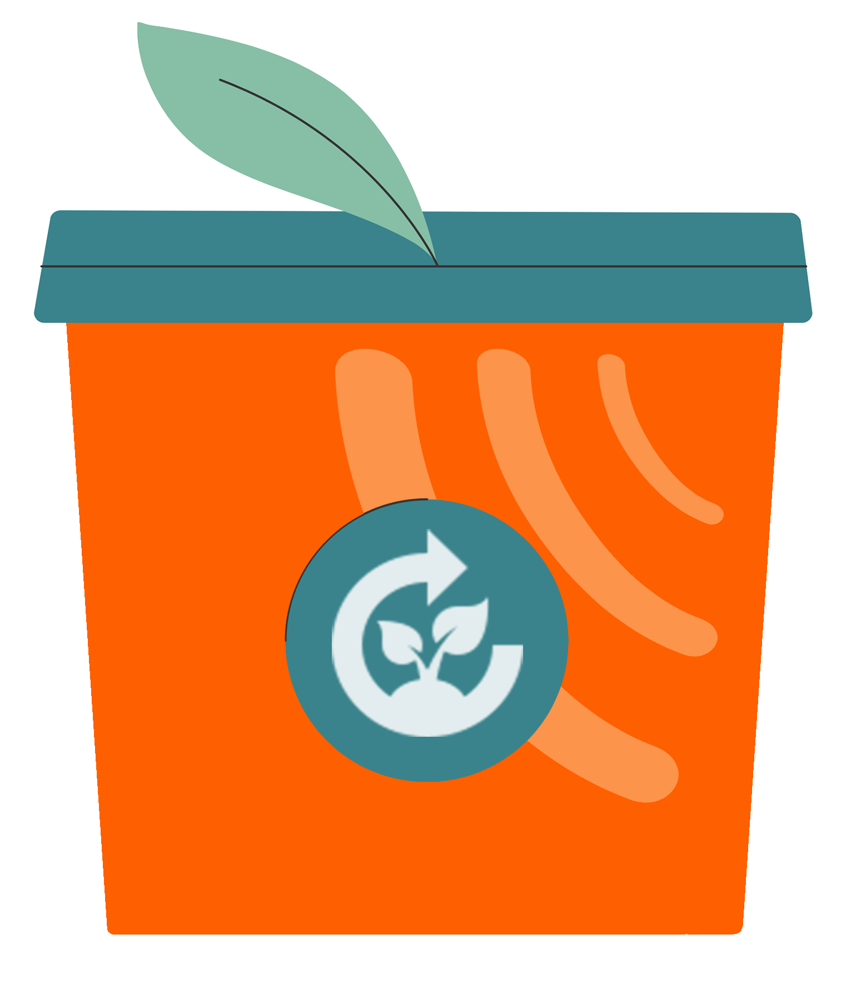
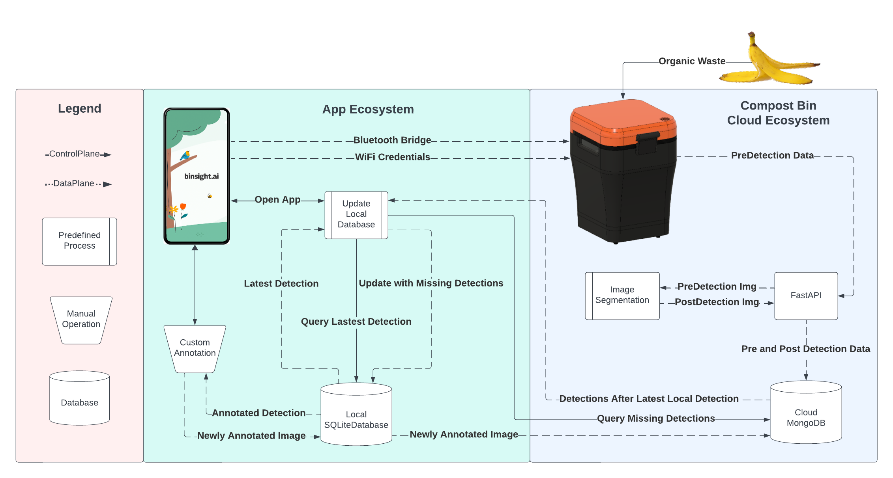

<p align="center">
  
  <h1 align="center">The binsight.ai App</h1>
</p>

# About/Overview

A cross-platform mobile app built with Flutter/Dart for users of [Soundbendor Lab's](https://www.soundbendor.org) Smart Compost Bin. 

<p align="center">
  
  <h4 align="center">The Soundbendor Lab's Smart Compost Bin, App Data Flow</h4>
</p>

The app enables Wi-Fi connectivity for the bin so that participants in a field study will be able to use their bin to track household food waste and follow their compost data trends over time.

## Table of Contents
- [Repos](#repos)
- [Purpose](#purpose)
- [Value Proposition](#value-proposition)
- [Getting Started](#getting-started)
- [Usage](#usage)
- [Features](#features)
- [Documentation](#documentation)
- [Contact Us](#contact-us)
- [Contributions](#contributions)
- [License](#license)

## Associated Git Repos

1. Food Waste: https://github.com/Soundbendor/food-waste
2. Food Detection embedded: https://github.com/Soundbendor/food-detection-embedded

## Purpose

In the face of an escalating climate crisis, finding more effective food waste disposal methods remains a pressing challenge in the field of sustainability research. To contribute valuable data to efforts in this field, the binsight.ai team pioneers one approach that is aimed at expanding our understanding of food and organic waste at the household and consumer level.

Our project supports a countertop Smart Compost Bin equipped with sensors that capture images of food waste and many associated data points. These include bin internal temperature and humidity, IAQ, CO2, the weight of composted food items, thermal imaging depth maps, and VOCs.

Users of the app will be presented with a fun and engaging user interface which will allow them to quickly set-up and begin using the Soundbendor Smart Compost Bin. After setting up the bin with Wi-Fi, any items the user composts will be sent to their app, enabling them to start annotating images and thus contributing to the larger dataset.

## Value Proposition

The binsight.ai team is pioneering their way through the field of Smart Composting and image annotation, and as such, there is no direct competition. All current solutions that are out there are working towards the same goal: Fighting the effects of food waste and climate change.

## Getting Started

1. Clone the repository to your local machine:

```bash
git clone https://github.com/Soundbendor/smart-bin-app.git
```

2. Install the Flutter SDK on your machine. Follow the instructions [here](https://flutter.dev/docs/get-started/install).
3. Build and run the app on your local machine:

```bash
flutter run
```

## Usage

To use the binsight.ai app:

1. Ensure you have a functional Wi-Fi network, as well as Bluetooth capability on your desired mobile device.
2. Install the app on the mobile device of your choice.
3. Open the app and complete the bin set-up process.
4. Use the Smart Compost Bin as you would any other composting solution.
5. After composting an item, check the detections page on your app to access and annotate your detection.
6. Watch your composting breakdown be populated over time.
7. Repeat from step 4, and have fun!

## Features

The binsight.ai app offers the following features and functionalities:

- Wi-Fi credential sharing via Bluetooth bridge to successfully connect the bin to its MongoDB Cloud database.
- Image annotation tools for users to draw object outlines and label food waste to build a novel dataset.
- A dashboard with data visualizations and analytics to support food waste goals, and increase user engagement.

## Documentation

The documentation for the binsight.ai app can be found in the [`docs`](./docs) directory.

The documentation can also be found through GitHub Pages [here](https://soundbendor.github.io/smart-bin-app/).

## Contact Us
Please feel free to reach out to our support email at:


## Contributions

Current contributors to this project are as follows:

Advising Professor:

- Dr. Patrick Donnelly, Oregon State University-Cascades

Development Team:

- [Blake Pugh](https://github.com/bpugh5), OSU student
- [Daniel Lau](https://github.com/theusaf), OSU student
- [Kimberly Markley](https://github.com/kimberlymarkley), OSU student
- [Micah Stahlberg](https://github.com/stalberm), OSU student

## License

See the [LICENSE](./LICENSE) file for details.